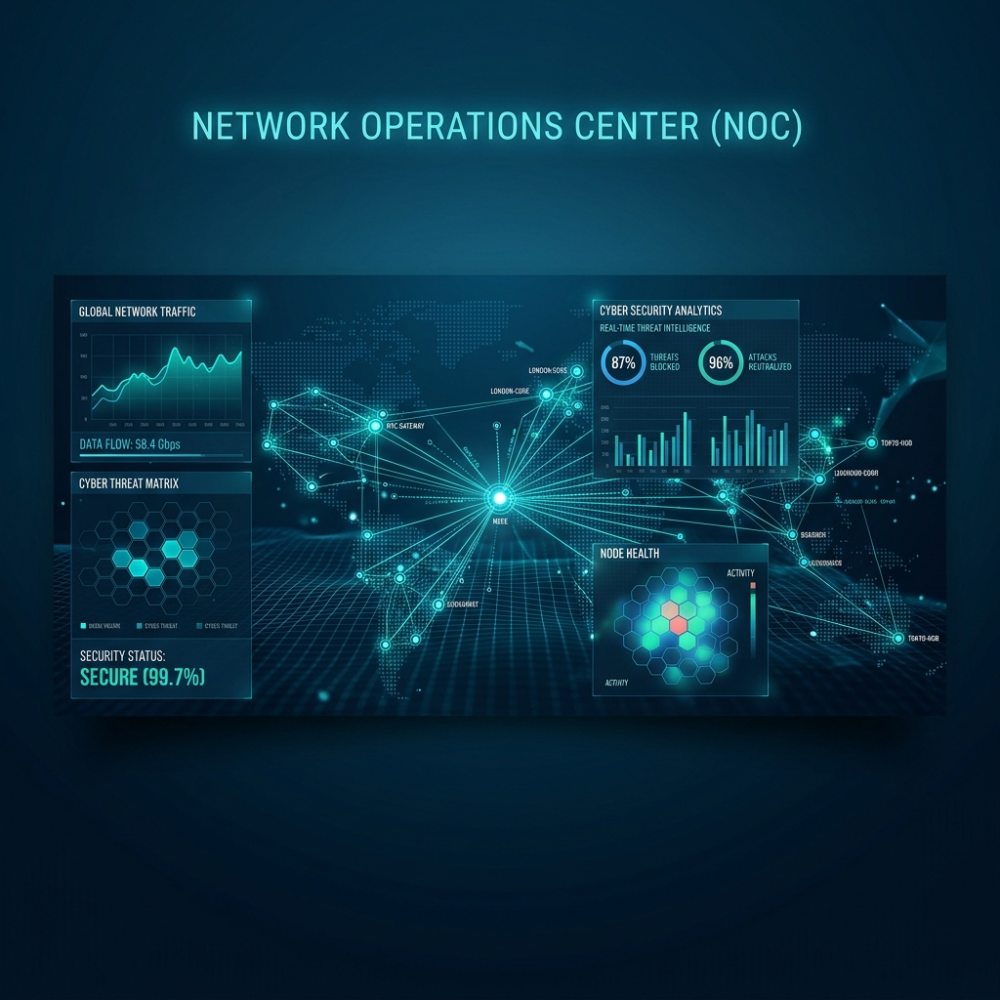

# Documentation Index

This directory contains the primary operational documentation for Ariba NOC Center.

## Documents

- [Technical Documentation](documentation/index.html)
  Implementation-oriented reference covering components, dependencies, configuration surfaces, data flows, storage, and operational constraints.

- [Setup Guide](setup.md)
  Deployment prerequisites, initial startup, service configuration, monitoring test cases, and troubleshooting.

- [Architecture](architecture.md)
  High-level platform design, service responsibilities, data flows, persistent volumes, and networking model.

- [Alert Runbook](alert-runbook.md)
  Response steps for host, performance, network, and security alerts.

## Recommended Reading Order

1. [Technical Documentation](documentation/index.html)
2. [Setup Guide](setup.md)
3. [Architecture](architecture.md)
4. [Alert Runbook](alert-runbook.md)

## Operational Scope

These documents cover:

- Docker-based deployment
- Monitoring and alerting configuration
- IDS and log pipeline setup
- Inventory and device management entry points
- Basic incident response workflow for common alerts

## Gaps You May Still Need To Fill

- Environment-specific SNMP credentials and discovery ranges
- Reverse proxy and TLS configuration
- Backup/restore procedure for volumes
- Team-specific escalation contacts and on-call ownership